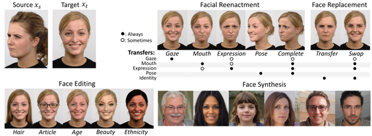

# Deepfake Detection Using Deep One-Class and Open-Set Recognition

This is the webpage for the "Deepfake Detection Using Deep One-Class and Open-Set Recognition" project supported by The Scientific and Technological Research Council of Turkey (TÜBİTAK) under grant no 121E465.

  
**Summary**

Digitally manipulated face images/videos, and especially those obtained via the recent artificial intelligence and deep learning algorithms which are commonly referred to as “DeepFake” (DF) techniques, present highly realistic looking images/videos of people saying and doing fake things. Such fake content now possesses the capacity to pose a significant impact on how one may decide the validity of information spread online. Such content modification and generation techniques may affect the human rights and the quality of public discourse-especially considering that DeepFakes may be deployed maliciously as a mechanism for manipulation, misinformation, persuasion and harassment. Due to the rapid advancement of DeepFake techniques, identification and detection of digitally manipulated media has become a technically demanding and rapidly evolving major challenge.
The majority of the existing DeepFake detection methods in the literature assume the problem as a closed-set two-class recognition task and collect both real and fake data to train a binary classifier to detect fake content. This modelling formalism, however, suffers from certain drawbacks. First, creation of fake training data is both computationally demanding and time consuming. Second, and more important, in the test phase, the trained binary classifiers are biased towards detecting samples which are generated by the models “seen” during the training stage. Any test sample which may be potentially developed using an “unseen model” then has a high chance of passing the detection system. Since, the creation of new DeepFake models has a fast pace as one may witness from the relevant literature, the DF detection problem in real-world settings is quite a challenging one.
Considering that DeepFakes pose a great threat to both the individuals as well as the society as a whole, the current project aims to propose and implement new and high-performance automated techniques for the DeepFake detection problem, and to improve upon the state-of-the-art methods in the real-world and challenging conditions of DeepFake image/videos. In this context, a particular focus shall be placed on the “unseen” scenario where a test sample is generated using a DeepFake model that was not seen during the training stage of the system. 

  
**Face Manipulation Categorisation**

Manipulation of faces in images/videos may be classified into four major groups based on the type and degree of manipulation involved as

•	Entire Face Image Synthesis: this type of face manipulation generates full non-existent facial images, typically via deep learning approaches such as Generative Adversarial Networks (GAN), e.g., by using the StyleGAN method [Karras et al., 2019]. Such techniques have managed to produce impressive outcomes, creating high definition face images with a great extent of authenticity.

•	Identity Replacement: this type of manipulation corresponds to changing the face of a subject in a video stream with that of a different individual. Typically, two methods are deployed for this purpose: 1) the conventional computer graphics methods such as FaceSwap ; and 2) new deep learning approaches referred to as DeepFakes , e.g., the FaceApp mobile application.

•	Attribute Manipulation: this type of face image manipulation, also referred to as face retouching or face editing, corresponds to making partial or minor changes to some features of a face such as the gender, adding glasses, age, the colour of the skin or the hair [Gonzalez-Sosa, 2018]. This type of manipulation is typically conducted using GANs such as the StarGAN method [Choi et al., 2018]. Applications such as FaceApp enable users to perform such attribute manipulations very conveniently.

•	Expression Swap: also referred to as face reenactment, involves modification of the facial expression of a subject according to the expressions of another person in a different video. Despite the existence of different manipulation techniques for this purpose [Liu et al., 2019], the most popular ones are those of Face2Face [Thies et al., 2016] and Neural Textures [Thies et al., 2019]. Some popular face reenactments include mouth reenactment (a.k.a. dubbing), gaze and pose reenactment.

Fig. 1: Different types of face image manioulations [Mirsky and Lee, 2021].

  
**Scope of the project**

The proposed project will span over different workpackages as follows.

- One-class classification for DF detection: novel one-class deep learning techniques, in particular deep convolutional networks, will be developed to detect deepfake face images/videos to improve the detection rate upon the state-of-the-art.

- One-Class Ensemble learning: the performance of multiple one-class learners will be boosted via different multiple classifier fusion systems, stacking ensembles, etc.

- One-Class Multiple Kernel Learning: the benefits offered by the reproducing kernel Hilbert space shall be utilised to devise multiple kernel systems for improved detection of deepfakes.

- Multi-Class Novelty Detection: the deepfake detection problem shall be formulated as an open-set recognition task for which open-set classification techniques will be developed and applied where the detection system would benefit from the previously seen deepfakes while also generalising to the previously unseen fake content.
- Person-specific Modelling: as each individual possesses specific facial characteristics, person-specific classifiers will be developed and tailored to each individual to improve the detection performance.

- Performance analysis on standard datasets: using standard and state-of-the-art datasets, the performance of the developed techniques will be becnhmarked and compared against the leading approaches from the literature.

  
**Project personnel**

[Shervin R. Arashloo](http://www.cs.bilkent.edu.tr/~s.rahimzadeh/index.html) (principal investigator)

Sepehr Nourmohammadi (research student)

  
**Related publications**

Parts of our preliminary research activities associated with the current project are published as follows.

1. Arashloo, S.R., “ℓp-Norm Support Vector Data Description”, Pattern Recognition, Elsevier, vol. 132, 108930, 2022. https://doi.org/10.1016/j.patcog.2022.108930.

2. Arashloo, S.R., “One-Class Classification Using ℓp-Norm Multiple Kernel Fisher Null Approach”, Image Processing, IEEE Transactions on, 2023. DOI: 10.1109/TIP.2023.3255102.

3. Arashloo, S.R., “Unknown Face Presentation Attack Detection via Localised Learning of Multiple Kernels”, Information Forensics and Security, IEEE Transactions on, vol. 18, pp. 1421-1432, 2023. https://doi.org/10.1109/TIFS.2023.3240841.

  
**References**

Karras, T., Laine, S. and Aila, T., 2019, "A Style-Based Generator Architecture for Generative Adversarial Networks," 2019 IEEE/CVF Conference on Computer Vision and Pattern Recognition (CVPR), pp. 4396-4405.

Gonzalez-Sosa, E., Fierrez, J., Vera-Rodriguez, R. and Alonso-Fernandez, F., 2018, “Facial soft biometrics for recognition in the wild: recent works, annotation and COTS evaluation”, IEEE Trans. Inf. Forensics Secur. 13 (8), 2001–2014.

Choi, Y., Choi, M., Kim, M., Ha, J., Kim, S. and Choo, J., 2018, "StarGAN: Unified Generative Adversarial Networks for Multi-Domain Image-to-Image Translation," 2018 IEEE/CVF Conference on Computer Vision and Pattern Recognition, pp. 8789-8797.

Liu, M., Ding, Y., Xia, M., Liu, X., Ding, E., Zuo, W. and Wen, S., 2019, “STGAN: A Unified Selective Transfer Network for Arbitrary Image Attribute Editing”, in: Proc. IEEE/CVF Conference on Computer Vision and Pattern Recognition.

Thies, J., Zollhöfer, M., Nießner, M., 2019, “Deferred neural rendering: image synthesis using neural textures”, ACM Trans. Graph. 38 (66),1–12.

Mirsky, Y., and Lee, W., 2021, “The Creation and Detection of Deepfakes: A Survey”, ACM Comput. Surv. 54, 1, Article 7, April, 41 pages.

